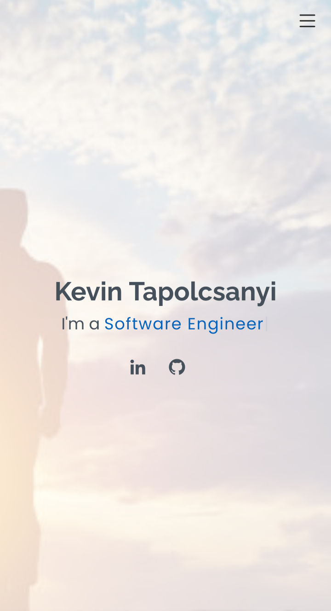

   
<!-- or should i use   -->

<h2 style="margin-top:12px" align="center">Languages</h2>

<table align="center">
    <tr>
        <td align="center"  width="140" height="112.43">
            
             JavaScript ES6
        </td>
        <td align="center"  width="140" height="112.43">
            
             React.js
        </td>
        <td align="center"  width="140" height="112.43">
            
             Node.js
        </td>
        <td align="center"  width="140" height="112.43">
            
             Express
        </td>
        <!-- add mongoDb heroku netlify git github rename to Technologies -->
    </tr>
</table>
   

<h1 align="center">Projects</h1>
<table bordercolor="#66b2b2">
  
  <tr>
    <td width="50%" valign="top">
      <h3 align="center">HR On-line Drop Box</h3>
         
        
         
        

          
    
  
      

        
<strong>Javascript, MongoDb, Heroku, Node.js, & Express.js</strong> - A hosted full stack crud app project that allows users to submit like and delete HR suggestions.

    </td>
    <td width="50%" valign="top">
      <h3 align="center">D's Diner"</h3>
         
      
         
        

          
  
  
      

        
<strong>HTML CSS</strong> - A mobile friendly netlify hosted website for D's Diner. 

    </td>
  </tr> 
</table>
<table bordercolor="#66b2b2">
  
  <tr>
    <td width="50%" valign="top">
      <h3 align="center">My Portfolio Website</h3>
         
        
         
        

          
    
  
      

        
<strong>HTML5UP, Javascript, JQuery, HTML, CSS</strong> - A github hosted Profile website

    </td>
    <td width="50%" valign="top">
      <h3 align="center">Nasa Picture of the Day</h3>
         
      
         
        

          
  
  
      

        
<strong>HTML CSS JS Nasa API</strong> - Fetch Historical Nasa Api by Day

    </td>
  </tr> 
</table>
