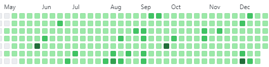

<h1 align="center">My Websites</h1>
<table bordercolor="#66b2b2">
  <!-- Start of table with Portfolio and Group Project Shoppin' It -->
  <tr>
    <td width="50%" valign="top"> <!--Start of Portfolio Website to use 50% of the window-->
      <h3 align="center">My Portfolio Website</h3>
      <br /> <!--Click Profile Image to open a new window to Profile website-->
      <a target="_blank" href="https://kevintapolcsanyi.netlify.app/">
        
      </a>
      <!-- [](https://kevintapolcsanyi.netlify.app/) -->
      <br />
      <p align="center"> <!--Click repo icon to link to GitHub Portfolio repo-->
      <a target="_blank" href="https://github.com/KevinTapol/PortfolioC" >
        
      </a>  <!--Click website icon to open a new window to Profile website-->
      <a target="_blank" href="https://kevintapolcsanyi.netlify.app/" >
          
      </a>
      </p> <!--Description of technologies and functionality of Portfolio website-->
      <p><strong>HTML, CSS Javascript, JQuery, Bootstrap Icons and Classes and Font Awesome Icons </strong> - A github hosted Profile website describing my learning progression of projects from MVC to APIs.</p>
    </td> <!--End of Portfolio-->
    
  </tr> <!--End of table row of Portfolio-->
</table>
<table bordercolor="#66b2b2">
  <td width="50%" valign="top"> <!--Start of Shoppin' It taking 50% of view window-->
      <h3 align="center">Shoppin' It (Group Project)</h3>
      <br /> <!--Click the Shoppin'It image to open a new window to Nasa API website-->
      <a target="_blank" href="https://group-project-shoppin-it.herokuapp.com/">
        
      </a><a target="_blank" href="https://group-project-shoppin-it.herokuapp.com/">
        
      </a>
      <br />
      <p align="center"> <!--Click repo icon link to open a new window to Shoppin'It Group Project GitHub repo-->
      <a target="_blank" href="https://github.com/KevinTapol/GroupProjectShoppingList" >
        
      </a> <!--Click website icon link to open a new window to Shoppin'It Group Project website-->
      <a target="_blank" href="https://group-project-shoppin-it.herokuapp.com/" >
        
      </a>
      </p> <!--Desciption of technologies and functionality of Shoppin'It Group Project-->
        <p><strong>MVC, HTML, CSS, JS, Node.js, Express.js, Mongoose, MongoDB, Passport.js, Session, Flash, Morgan, dotenv, Git/Github, Heroku</strong> - Signup to create an account and login to your groceries list. Full stack MVC CRUD app allowing you get your grocery list, add new groceries, update your grocery list by marking out groceries shopped and delete groceries.Hosted on Heroku for back end application.</p>
    </td> <!--End of Shoppin'It Group Project-->
</table>

<!-- Start of table with Nasa API  -->
<table bordercolor="#66b2b2" align="center">
  <!-- Start of table with Portfolio and Nasa Api -->
  <tr align="center">
    <td width="50%" valign="top"> <!--Start of Nasa API taking 50% of view window-->
      <h3 align="center">Nasa Picture of the Day</h3>
      <br /> <!--Click Nasa Api image to open a new window to Nasa API website-->
      <a target="_blank" href="https://kevintapol.github.io/NasaApi/index.html">
        
      </a>
      <br />
      <p align="center"> <!--Click repo icon link to open a new window to Nasa API GitHub repo-->
      <a target="_blank" href="https://github.com/KevinTapol/NasaApi" >
        
      </a> <!--Click website icon link to open a new window to Nasa API website-->
      <a target="_blank" href="https://kevintapol.github.io/NasaApi/index.html" >
        
      </a>
      </p> <!--Desciption of technologies and functionality of Nasa API-->
        <p><strong>HTML, CSS, JS, Node.js, dotenv, Git/Github, Nasa API</strong> - Fetch Historical Nasa API by Day</p>
    </td> <!--End of Nasa API-->    
  </tr> <!--End of table row of Portfolio and Nasa API-->
</table>

<!-- Start of table with HR box and D's Diner -->
<table bordercolor="#66b2b2">
  <!-- Start of HR Box and D's Diner table row -->
  <tr>
    <td width="50%" valign="top"> <!--Set table to use 50% of the window for HR Box-->
      <h3 align="center">HR On-line Drop Box</h3>
      <br /> <!--Click on image and open a new window to the HR Box website-->
      <a target="_blank" href="https://hr-box.herokuapp.com/">
        
      </a>
      <br />
      <p align="center"> <!--Click for GitHub repo link to HR Box-->
      <a target="_blank" href="https://github.com/KevinTapol/HR-Box" >
        
      </a> <!--Click on link to project website and open a new window to the HR Box website-->
      <a target="_blank" href="https://hr-box.herokuapp.com/" >
        
      </a>
      </p> <!--Desription of technologies used and what the HR Box functionality -->
        <p><strong>Javascript, MongoDb, Heroku, Node.js, & Express.js</strong> - A hosted full stack crud app project that allows users to submit like and delete HR suggestions.</p>
    </td>
    
</table>

<table bordercolor="#66b2b2" align="center">
  <tr>
    <td width="50%" valign="top"> <!--Set table to use 50% of the window-->
      <h3 align="center">D's Diner</h3> <!--Start of D's Diner-->
        <br /> <!--Click on project image and open a new window to D's Diner website-->
        <a target="_blank" href="https://dees-diner.netlify.app/">
          
        </a>
        <br />
        <p align="center"> <!--Click for link to D's Diner GitHub repo-->
        <a target="_blank" href="https://github.com/KevinTapol/diner">
          
        </a> <!--Click website icon link to open a new window to D's Diner website-->
        <a target="_blank" href="https://dees-diner.netlify.app/" >
          
        </a>
        </p> <!--Description of technologies and functionality of D's Diner-->
        <p><strong>HTML CSS</strong> - A mobile friendly netlify hosted website for D's Diner. </p>
    </td> <!--End of D's Diner-->
  </tr> <!--End of table row of both HR Box and D's Diner-->
</table>

<table bordercolor="#66b2b2">
  <!-- Start of table with Portfolio and Group Project Shoppin' It -->
  <tr>
    <td width="50%" valign="top"> <!--Start of Shoppin' It taking 50% of view window-->
      <h3 align="center">Codewars for JavaScript</h3>
      <br /> <!--Click the the Ranking to go to my CodewarsProfile-->
      <a target="_blank" href="https://www.codewars.com/users/KevinTap">
        
      </a><a target="_blank" href="https://www.codewars.com/users/KevinTap">
      </br></br>
        <p align="center">
          
        </p>
      </a>
      <br />
      <p align="center"> <!--Click repo icon link to open a new window to Codewars GitHub repo-->
      <a target="_blank" href="https://github.com/KevinTapol/codewars-js" >
        
      </a> <!--Click website icon link to open a new window to My Codewars Profile-->
      <a target="_blank" href="https://www.codewars.com/users/KevinTap" >
        
      </a>
      </p> <!--Desciption of technologies and functionality of Shoppin'It Group Project-->
        <p><strong>JavaScript</strong> - I do a Codewars everyday to keep pushing myself to grow and learn. Once I have solved the problem myself, I study the alternate answers of best practices, most clever and interesting solutions from my fellow coders. My first answer will always be the most easy to follow. Lately I have been challenging myself to also give a one line answer on top of my version of best practices.</p>
    </td> <!--End of Shoppin'It Group Project-->
  </tr> <!--End of table row of Portfolio and Shoppin'It-->
</table>

<!--I'm considering putting the Veteran image and Technologies into a table as well like the projects-->

<!-- tag that centers Image -->
<!-- <center>img</center> no longer works-->
<!--  no longer works -->
<!--  no longer works-->
<!-- current solutions are to next in p tag or table > td and add align="center" -->
<table align="center">
  <tr>
    <td align="center"> 
      <p align="center">
        
      </p>
    </td>
  </tr>
</table>

<!-- Technologies -->
<h2 style="margin-top:12px" align="center">Technologies</h2>
<p align="center">
    
    
    
    
    
    
    
    
    
    
    
    
    <!--  -->
    
</p>

<!-- @media only screen and (max-width: 640px) {
	h4 {
		font-size: 88px;
	}
}

@media (min-width: 576px) { ... } -->

<!-- table for technologies -->
<!-- <table align="center">
    <tr> 
        <td align="center"  width="140" height="112.43">
            
            <br>JavaScript ES6
        </td> 
        <td align="center"  width="140" height="112.43">
            
            <br>React.js
        </td>
        <td align="center"  width="140" height="112.43">
            
            <br>Node.js
        </td> 
        <td align="center"  width="140" height="112.43">
            
            <br>Express
        </td>
    </tr>
</table>
</br></br></br> -->


<!-- Alternate markdown styles -->
<!-- @media (min-width: 576px) { ... }
*use \ to escape just like \*javascript*
*italic*
_italic_
**strong**
__strong__
~~strike through~~
---
___
[Link](http://placekitten.com)

# UL
* item 1
* item 2
  * nested item 1
  * nested item 2

# OL
1. Item 1
1. Item 2
1. Item 3

## Inline Code Block

`<p>Paragraph</p>`

### Images


# GitHub Markdown

### Code Blocks
```bash
  npm install
  npm start
```

```javascript
  funciton add()(num1, num2) {
    return num1 + num2;
  }
```
| Name    | Email         |
|---------|---------------|
|John Doe | john@gmail.com|
|Jane Doe | jane@gmail.com|

* [x] Task 1
* [ ] Task 2 -->
<!--  -->

<!-- &color=cdd148&style=plastic&logo=<TECH_LOGO>"> -->
<!-- [](https://kevintapolcsanyi.netlify.app/) -->